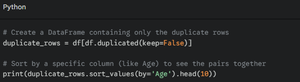
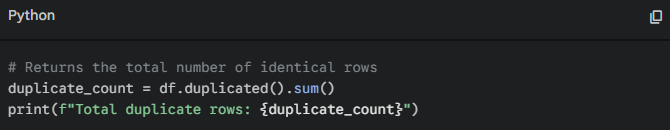

# Reflection
## When should you use AI for assistance, and when should you rely on your own skills?
AI is very good at summarizing and generating information from them. I think it would be good to have AI assistance in things like research summarization, structuring work, brainstorming ideas, and generating basic code templates.  
AI should not be used when making final decisions in things that are high stakes, and in cases where our personal style/ creative work is important. AI can generate false information, hence it is important for us to validate and check information and not blindly paste it. 

## How can you avoid over-reliance on AI while still benefiting from it?
Well the simple answer is to not use AI all that much. Using AI to perform tasks that we don't know how to or understand should not be done. I believe it is best to only benefit from AI in doing time consuming tasks that are repetitive, or hold no meaning in doing ourselves.  
AI can help us learn and gain knowledge on things, but shouldn't directly perform tasks and inhibit that learning process.

## What steps will you take to ensure data privacy when using AI tools?
1. Never input sensitive data into any AI tools
2. Anonymize data
4. If possible, remove permission for prompts to be used by the AI tool for training, and remove any uneccesary permisions.
5. Use trustworthy AI tools. 

# Task:
## One task I can improve using AI, and what was the results
A task I can improve would be code cleanup, reviewing or generating. AI is quite good at this based on my experience. For example:
I've asked Gemini to help guide and generate code for data preparation and cleanup for a machine learning project. Specificall I asked "I would like to find duplicates in a dataset, and find their indexes". The output gave good explanations along with some code output:

In this case, I checked and verified the results by directly using and testing it for the results. It did not require any further editing. 

## A new best practice when using AI:
I would try to anonymize and remove any sensitive information into AI prompts. 
