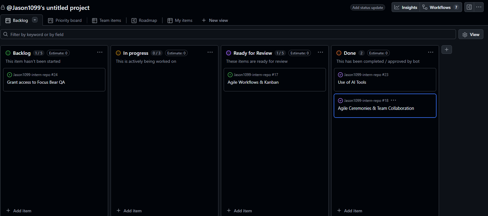

# Research
## How does a Kanban board work, and how does it help manage workflow?
The kanban board is an agile visual tool. It works by representing tasks as cards and moving them across columns representing progress i.e. To do, in progress, done. It manages workflow by making it easier to see what tasks are being done and their progress, allowing managers to allocate or deallocate members to different tasks depending on how they're going. 

## What do the different columns on a Kanban board represent?
The columns represent stages of the development process, such as backlog, in progress, and done. 

## How do tasks move through the board, and who is responsible for updating them?
I believe the person moving the cards should be the group/individual working on them. A manager may oversee the board and ensure everything is correct. The cards would move from one stage or column to the next following column. 

## What are the benefits of limiting work in progress (WIP)?
It helps limit multitasking, making team members focus on less tasks. Also makes it easier to identify bottlenecks

# Reflection
## How does Kanban help manage priorities and avoid overload?
Kanban help manage priorities by letting cards or tasks to be labeled according to their priority levels, and avoid overload by limiting the amount of tasks being done at the same time. 

## How can you improve your workflow using Kanban principles?
- I can improve my workflow by planning/visualizing it, as I can see the whole board for myself and see where Im at.
- Focus on less tasks at once with WIP limiting
- Discuss changes or finished tasks with the team

# Task
Task 1 and 2: Added kanban on my github projects section

An example of using the board, I've just used it to re-add the specific issue for this page to "ready for review" from done. 

## Identify one way you can improve task tracking in your role.
Use the kanban daily, and update cards correctly as soon as possible. 
