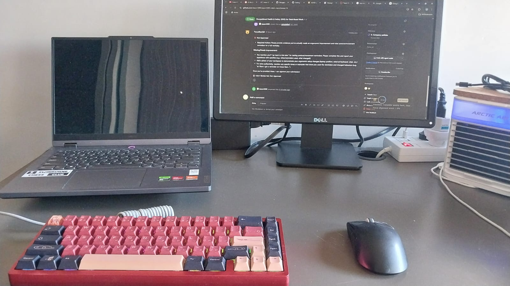

# Research
## What are the risks of using a laptop without an external monitor or keyboard?
Using a laptop without a keyboard or monitor can have health risks for wrists, and posture due to the monitor and keyboard of laptops being inadjustable, and can be crampt. Eye strains may also be present by using a smaller laptop screen

## What ergonomic equipment can improve posture when working on a laptop?
1. A laptop stand can elevate the screen to around eye level, improving posture. We can also just use an external monitor
2. An external mouse and keyboard. Having external input devices makes it very flexible in terms of positioning, as well as making it more comfortable to use instead of the inbuild input functions on a laptop, which will improve posture
3. Ergonomic chairs will support the spine while working, ensuring good posture
4. Footrests can help to support the legs and lower back pressure

## What adjustments should be made to monitor height, chair position, and desk setup for a healthier workspace?
for monitors, it is reccomended to keep it at eye level to avoid neck pains and good posture. Try to put it around an arm's length away
for chair position, it should allow for the feet to rest fully on the floor, keepinga 90 degree angle on the knees
for desk setup, try have external input devices like a keyboard and mouse. Try to hav the height of the desk around elbow height, where our forearms would be parallel to the floor. Also ensure clearance for legs to move freely. 

## What are some daily habits that reduce the impact of prolonged laptop use?
For eye strain:
1. 20-20-20 rule; Every 20 minutes, look away from the screen and focus on an object 20 feet away (about 6 metres) for 20 seconds.
2. Conscious blinking to keep eyes moist
3. Keep adjusting screen brightness

For pyhisical health:
1. Stand often (every 30 - 60 mins) to reduce strain and improve circulation
2. Shoulder blade squeezes help counteract hunching
3. neck rotation and stretches to reduce neck strain

# Reflection
## What equipment changes can you make to improve your workspace setup?
I already use an external keyboard and mouse, but I can definitely benefit from an ergonomic chair, and a better laptop stand to adjust height

## What behavioural changes can you implement to improve posture and reduce strain?
I actually havent really implemented any new habits for behaviours, so I would love to start on some:
1. Standing up and do some stretching every now and then.
2. the 20-20-20 eye rule
3. Try to sit upright instead of laying down or being hunched over

## How can you remind yourself to maintain good posture and take breaks throughout the day?
As suggested, I can easily use Focus Bear app to remind me to do so

# Task
## Adjust your laptop setup based on ergonomic best practices.
Ive adjusted the distance of my monitor and laptop, along with using a keyboard and mouse!

## Identify at least one piece of equipment that could improve your posture and comfort
An ergonomic chair would be nice

## Try using posture and movement reminders for a full workday and note any improvements. 
I've used focus bear's micro break feature during focus sessions, and I've noticed my neck and back is less strained and stiff now. 

## Document at least one workspace change or habit adjustment you made
I'm doing stretches and the 20-20-20 rule every now and then, and it really helps!

