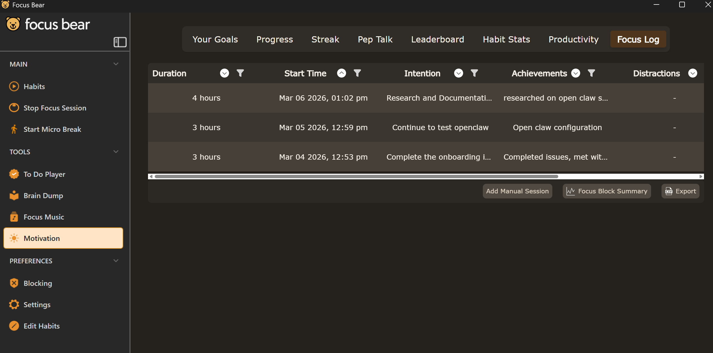

## Monday:
>Time: 3Pm - 4Pm
>Location: Swinburne in person workday
>Time: 10Am - 11Am
>Location: Work From Home

## Wednesday - Thursday:
> 1pm - 4pm
> Location: Work From Home

## Friday:
> 1pm - 5pm
> Location: Work From Home

*Planned to spread out my plan of 12 hour work weeks*

## Snippet of using Focus Bear focus sessions for logging time:

